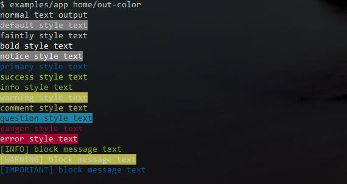
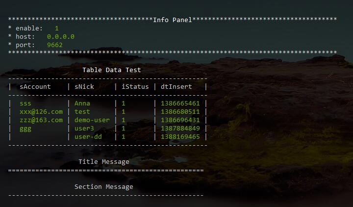

# console tool 

a php console application library.

- console application, run command/controller
- console input/output
- console color support
- console interactive

## usage

```
use inhere\console\io\Input;
use inhere\console\io\Output;
use inhere\console\App;

$input = new Input;
$output = new Output;
$app = new App([], $input, $output);
```

## input

example(in terminal):

```
./bin/app image/packTask name=john -d -s=test --debug=true
php bin/cli.php start name=john -d -s=test --debug=true
```

get command info:

```
$script = $input->getScript();   // './bin/app'    'bin/cli.php'
$command = $input->getCommand(); // 'image/packTask' 'start'

// argument
$name = $input->get('name', 'default'); // 'john'
$s = $input->get('s', 'default'); // 'test'

// option
$d = $input->getBool('d') // True
$debug = $input->getBool('debug') // True
$noexists = $input->getBool('noexists') // False
```

get user input:

```
echo "Your name:";

$text = $input->read(); 
// in terminal
// Your name: simon

echo $text; // 'simon'
```

## output

basic output:

```
$output->write($message);
```

### formatted output

#### use color style 



#### special format  

- `$output->title()`
- `$output->section()`
- `$output->panel()`
- `$output->table()`
- `$output->helpPanel()`



## more interactive

in the class `inhere\librarys\console\Interact`

interactive method:

### `Interact::select()` (alias `Interact::chioce()`)

Select one of the options

```
select($description, $options, $default = null, $allowExit=true)
choice($description, $options, $default = null, $allowExit=true)
```

- example 1:

 only value, no setting option

```
$select = Interact::select('Your city is ?', [
    'chengdu', 'beijing', 'shanghai'
]);

```

output in terminal:
```
Your city is? 
  0) chengdu
  1) beijing
  2) shanghai
  q) Quit // quit option. is auto add. can setting it by 4th argument.
You choice: chengdu
```

```
echo $select; // '0'
```

- example 2:

custom option, setting a default value.

```
$select = Interact::select('Your city is ?', [
    'a' => 'chengdu',
    'b' => 'beijing',
    'c' => 'shanghai'
], 'a');
```

output in terminal:

```
Your city is? 
  a) chengdu
  b) beijing
  c) shanghai
  q) Quit // quit option. is auto add. can setting it by 4th argument.
You choice[default:a] : beijing
```

```
echo $select; // 'b'
```

### `Interact::confirm()`

### `Interact::question()`

### `Interact::loopAsk()`

```

```

## formatted output
