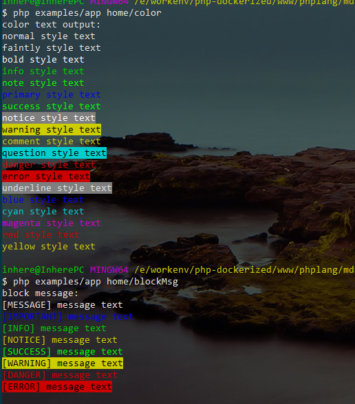
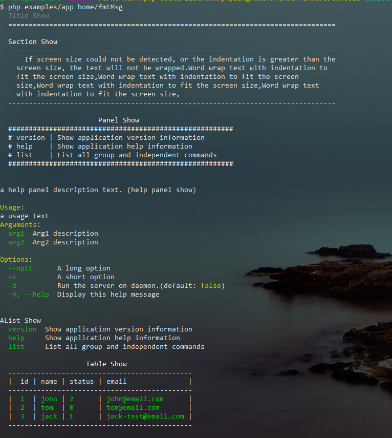

# php 命令行应用库

简洁的php命令行应用库。提供控制台参数解析, 颜色风格输出, 用户信息交互, 特殊格式信息显示

- 命令行应用, 命令行的选项参数解析
- 命令行 input/output
- 颜色风格输出支持
- 特殊格式信息显示
- 用户信息交互支持
- 其他功能

## 项目地址

- **github** https://github.com/inhere/php-console.git
- **git@osc** https://git.oschina.net/inhere/php-console.git

**注意：**

- master 分支是要求 `php >= 7` 的(推荐使用)。
- [php5](./tree/php5/) 是 php 5 的分支，但有些时间没更新了(但是基本的功能都支持)。

## 安装

- 使用 composer

编辑 `composer.json`，在 `require` 添加

```
"inhere/console": "dev-master",
```

然后执行: `composer update`

- 直接拉取

```
git clone https://git.oschina.net/inhere/php-console.git // git@osc
git clone https://github.com/inhere/php-console.git // github
```

## 快速开始

如下，新建一个入口文件。 就可以开始使用了

```php
// file: examples/app
use inhere\console\io\Input;
use inhere\console\io\Output;
use inhere\console\App;

$config = [];
$input = new Input;
$output = new Output;
$app = new App($config, $input, $output);

// add command routes
$app->command('demo', function (Input $in, Output $out) {
    $cmd = $in->getCommand();

    $out->info('hello, this is a test command: ' . $cmd);
});
// ... ...

// run
$app->run();
```

然后在命令行里执行 `php examples/app`, 立即就可以看到如下输出了:

```bash
$ php examples/app
Usage:
  examples/app [route|command] [arg1=value1 arg2=value ...] [-v|-h ...]

Example:
  examples/app test
  examples/app home/index

There are all console controllers and independent commands.
Group Commands:(by Controller)
  ... No register any group command

Independent Commands:
  demo  A Closure // 这就是我们添加的一个独立命令

Internal Commands:
  help     Show application help information
  list     List all group and independent commands
  version  Show application version information

more please see: examples/app [controller|command]

```

## 添加命令

添加命令的方式有三种

- 如上所示，使用闭包可以快速的添加一个简单的命令
- 通过继承 `inhere\console\Command` 添加独立命令

```php
use inhere\console\utils\AnsiCode;

/**
 * Class Test
 * @package app\console\commands
 */
class TestCommand extends Command
{
    /**
     * execute
     * @param  inhere\console\io\Input $input
     * @param  inhere\console\io\Output $output
     * @return int
     */
    public function execute($input, $output)
    {
        $output->write('hello, this in ' . __METHOD__);
    }
}
```

注册命令，在 `$app->run()` 之前通过 `$app->command('test', TestCommand::class)` 注册独立命令。

- 通过继承 `inhere\console\Controller` 添加一组命令(命令行的控制器类)

```php
use inhere\console\Controller;

/**
 * default command controller. there are some command usage examples
 */
class HomeController extends Controller
{
    const DESCRIPTION = 'default command controller. there are some command usage examples';

    /**
     * this is a command's description message
     * the second line text
     * @usage usage message
     * @example example text one
     *  the second line example
     */
    public function indexCommand()
    {
        $this->write('hello, welcome!! this is ' . __METHOD__);
    }
}
```

注册命令，在 `$app->run()` 之前通过 `$app->controller('home', HomeController::class)` 注册命令组。

说明：

命令组(eg `HomeController`) 中的命令(eg: `indexCommand`)上注释是可被解析的。

- 当你使用 `php examples/app home -h` 时，可以查看到 `HomeController::indexCommand` 的描述注释文本
- 当使用 `php examples/app home/index -h` 时，可以查看到关于 `HomeController::indexCommand` 更详细的信息。包括描述注释文本、`@usage` 、`@example`

> 小提示：注释里面同样支持带颜色的文本输出 `eg: this is a command's description <info>message</info>`

更多请查看 [examples](./examples) 中的示例代码

## 输入

> 输入对象是 `inhere\console\io\Input` 的实例

在终端中执行如下命令，用于演示参数选项等信息的解析:

```bash
$ php examples/app home/useArg status=2 name=john arg0 -s=test --page=23 --id=154 -e dev -v vvv -d -rf --debug --test=false
```

**一点说明：**

- 没有 `-` 开头的都认为是参数 (eg: `status=2` `arg0`)
- 反之，以 `-` 开头的则是选项数据
    - `--` 开头的是长选项(long-option)
    - 一个 `-` 开头的是短选项(short-option)

> 支持混合式选项的赋值 `--id=154` 和 `--id 154` 是等效的

**注意:** 输入如下的字符串将会认为是布尔值

- `on|yes|true` -- `true`
- `off|no|false` -- `false`

### 获取命令基本信息:

```php
echo $input->getScript();   // 'examples/app' 执行的入口脚本文件
echo $input->getCommand(); // 'home/useArg' 解析到的第一个参数将会被认为是命令名称，并且不会再存入到 参数列表中
echo $input->getFullScript(); // 命令行输入的原样字符串
```

### 获取解析后的参数信息

> 通常的参数如 `arg0` 只能根据 index key 来获取值。但是提供以等号(`=`)连接的方式来指定参数名(eg: `status=2`)

打印所有的参数信息：

```php
var_dump($input->getArgs());
```

output:

```php
array(3) {
  'status' => string(1) "2"
  'name' => string(4) "john"
  [0] => string(4) "arg0"
}
```

扩展方法:

```php
// argument
$first = $input->getFirstArg(); // 'arg0'
$status = $input->get('status', 'default value'); // '2'
```

### 获取解析后的选项信息

- 没有值的选项，将设置默认值为 `bool(true)`
- 短选项不仅仅只是以一个 `-` 开头，而且名称 **只能是一个字符**
- 多个(默认值的)短选项可以合并到一起写。如 `-rf` 会被解析为两个短选项 `'r' => bool(true)` `'f' => bool(true)`

打印所有的选项信息：

```php
var_dump($input->getOpts());
// var_dump($input->getLOpts()); // 只打印长选项信息
// var_dump($input->getSOpts()); // 只打印短选项信息
```

output:

```php
array(10) {          
  's' => string(4) "test"   
  'e' => string(3) "dev"    
  'v' => string(3) "vvv"    
  'd' => bool(true)         
  'r' => bool(true)         
  'f' => bool(true)         
  'page' => string(2) "23"     
  'id' =>   string(3) "154"    
  'debug' => bool(true)         
  'test' => bool(false)        
}
```

扩展方法:

```php
// option
$page = $input->getOpt('page') // '23'
$debug = $input->boolOpt('debug') // True
$test = $input->boolOpt('test') // False

$d = $input->boolOpt('d') // True
$d = $input->sBoolOpt('d') // True
$showHelp = $input->sameOpt(['h','help']) // 获取到一个值就返回，适合同一个含义的选项
```

### 读取用户输入

```php
echo "Your name:";

$name = $input->read(); 
// in terminal
// Your name: simon

echo $name; // 'simon'
```

也可以直接将消息文本放入参数 `$name = $input->read("Your name:");`

## 输出

> 输出对象是 `inhere\console\io\Output` 的实例

基本输出:

```php
public function write(mixed $messages = '', $nl = true, $quit = false)
```

- `$messages` mixed 要输出的消息。可以是字符串或数组。
- `$nl` bool 输出后是否换行。 默认 `true`
- `$quit` bool|int 输出后是否退出脚本。默认 `false`, 其它值都会转换为 `int` 作为退出码(`true` 会转换为 0)。

```php
$output->write('hello');
$output->write(['hello', 'world']);
```

## 格式化的输出

### 带颜色风格的输出

`$output` 的 `write()` 方法支持带颜色风格的输出(当然得终端支持才行)

```php
$output->write('hello <info>world<info>');
```

已经内置了常用的风格:



### 更多特殊格式化输出

来自于类 `inhere\console\utils\Show`。

> output 实例拥有 `inhere\console\utils\Show` 的所有格式化输出方法。不过都是通过对象式访问的。

#### 标题文本输出

使用 `Show::title()/$output->title()`

```php
public static function title(string $title, array $opts = [])
```

#### 段落式文本输出

使用 `Show::section()/$output->section()`

```php
public static function section(string $title, string|array $body, array $opts = [])
```

#### 列表数据展示输出 

```php
public static function aList(array $data, string $title, array $opts = [])
```

使用 `Show::aList()/$output->aList()`

```php
$title = 'list title';
$data = [
     'name'  => 'value text',
     'name2' => 'value text 2',
];
Show::aList($data, $title);
```

#### 多列表数据展示输出

```php
public static function mList(array $data, array $opts = [])
```

使用 `Show::mList()/$output->mList()` 别名方法 `Show::multiList()`

```php
$data = [
  'list1 title' => [
     'name' => 'value text',
     'name2' => 'value text 2',
  ],
  'list2 title' => [
     'name' => 'value text',
     'name2' => 'value text 2',
  ],
  // ... ...
];

Show::mList($data);
```

#### 面板展示信息输出

```php
public static function panel(mixed $data, $title = 'Information Panel', $borderChar = '*')
```

使用 `Show::panel()/$output->panel()`

#### 数据表格信息输出

```php
public static function table(array $data, $title = 'Data Table', array $opts = [])
```

使用 `Show::table()/$output->table()`

- 可直接渲染从数据库拉取的数据(会自动提取字段名作为表头)

```php
// like from database query's data.
$data = [
 [ col1 => value1, col2 => value2, col3 => value3, ... ], // first row
 [ col1 => value4, col2 => value5, col3 => value6, ... ], // second row
 ... ...
];

Show::table($data, 'a table');
```

- 自己构造数据时，还要写字段名就有些麻烦了。so, 可以通过选项配置 `$opts` 手动配置表头字段列表

```php
// use custom head
$data = [
 [ value1, value2, value3, ... ], // first row
 [ value4, value5, value6, ... ], // second row
 // ... ...
];

$opts = [
  'showBorder' => true,
  'tHead' => [col1, col2, col3, ...]
];
Show::table($data, 'a table', $opts);
```

#### 快速的渲染一个帮助信息面板 

```php
public static function helpPanel(array $config, $showAfterQuit = true)
```

使用 `Show::helpPanel()/$output->helpPanel()`

```php
Show::helpPanel([
    Show::HELP_DES => 'a help panel description text. (help panel show)',
    Show::HELP_USAGE => 'a usage text',
    Show::HELP_ARGUMENTS => [
        'arg1' => 'arg1 description',
        'arg2' => 'arg2 description',
    ],
    Show::HELP_OPTIONS => [
        '--opt1' => 'a long option',
        '-s' => 'a short option',
        '-d' => 'Run the server on daemon.(default: <comment>false</comment>)',
        '-h, --help' => 'Display this help message'
    ],
], false);
```

### 渲染效果预览



## 用户交互方法

需引入类 `inhere\console\utils\Interact`

### 从给出的列表中选择一项

```php
public static function select($description, $options, $default = null, $allowExit=true)
public static function choice($description, $options, $default = null, $allowExit=true) // alias method
```

使用 `Interact::select()` (alias `Interact::chioce()`)

- 示例 1: 只有值，没有选项key

```php
$select = Interact::select('Your city is ?', [
    'chengdu', 'beijing', 'shanghai'
]);
```

渲染结果(in terminal):

```
Your city is ? 
  0) chengdu
  1) beijing
  2) shanghai
  q) Quit // quit option. is auto add. can setting it by 4th argument.
You choice: 0
```

```php
echo "$select"; // '0'
```

- 示例 2:

有选项key, 并且设置了一个默认值.

```php
$select = Interact::select('Your city is ?', [
    'a' => 'chengdu',
    'b' => 'beijing',
    'c' => 'shanghai'
], 'a');
```

渲染结果(in terminal):

```
Your city is? 
  a) chengdu
  b) beijing
  c) shanghai
  q) Quit // quit option. is auto add. can setting it by 4th argument.
You choice[default:a] : b
```

```php
echo $select; // 'b'
```

### 要求确认是否继续执行

```php
public static function confirm($question, $default = true) bool
```

使用 `Interact::confirm()` :

```php
$result = Interact::confirm('Whether you want to continue ?');
```

渲染结果(in terminal):

```
Whether you want to continue ?
Please confirm (yes|no) [default:yes]: n
```

结果: 

```php
var_dump($result); // bool(false)
```

### 询问，并返回用户的回答

```php
public static function ask($question, $default = null, \Closure $validator = null)
public static function question($question, $default = null, \Closure $validator = null)
```

使用 `Interact::question()`/`Interact::ask()`

```php
$answer = Interact::ask('Please input your name?', null, function ($answer) {
    if (!preg_match('/\w+/', $answer)) {
         Interact::error('The name must match "/\w+/"');
        
         return false;
    }

    return true;
});
```

### 有次数限制的询问

```php
public static function limitedAsk($question, $default = null, \Closure $validator = null, $times = 3)
```

有次数限制的询问,提出问题

* 若输入了值且验证成功则返回 输入的结果
* 否则，会连续询问 `$times` 次，若仍然错误，退出


```php
// no default value
$answer = Interact::limitedAsk('please input you age?', null, function($age)
{
    if ($age<1 || $age>100) {
        Interact::error('Allow the input range is 1-100');
        return false;
    }

    return true;
});
```

## License

MIT
